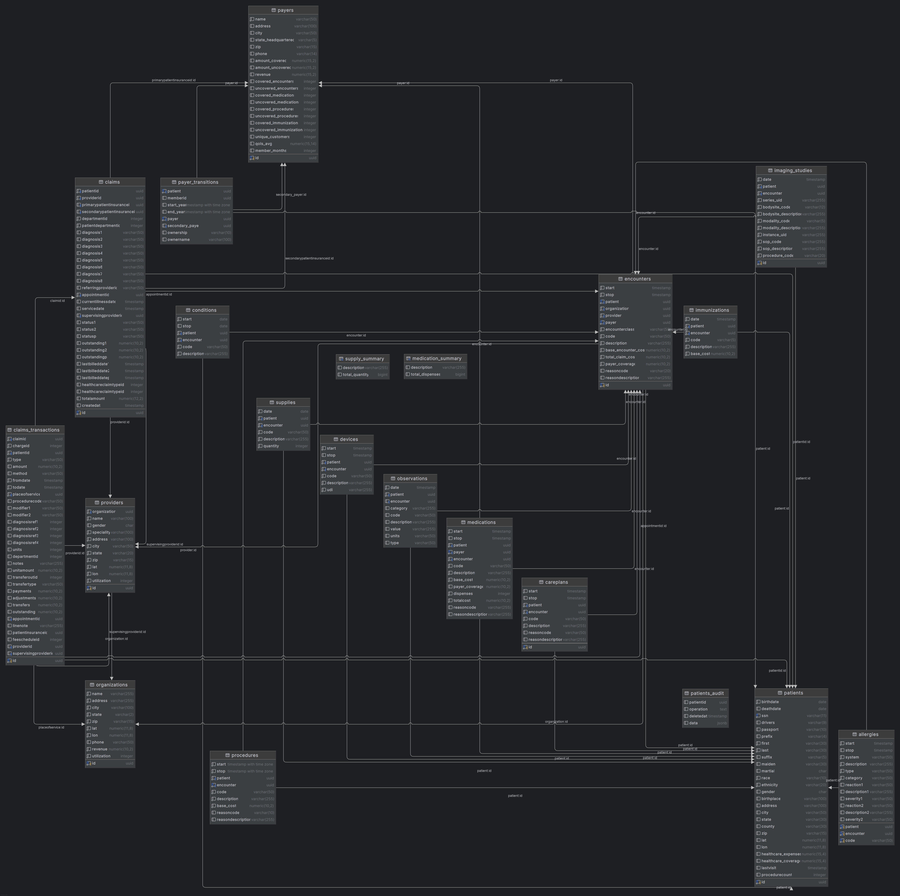

# Hospital Database

**Authors:**

  * Michał Pędziwiatr
  * Michał Mizia
  * Kacper Siemionek
  * Miłosz Andryszczuk
  * Wojciech Zieziula

## Table of Contents

  * [Overview](#overview)
  * [Technical Overview](#technical-overview)
      * [Project Goal](#project-goal)
      * [Technology Stack](#technology-stack)
      * [Application Features](#application-features)
      * [Database Logic](#database-logic)
      * [Database Diagram](#database-diagram)
      * [Testing](#testing)
  * [Setup Tutorial](#setup-tutorial)
      * [Prerequisites](#prerequisites)
      * [1. Configure Environment](#1-configure-environment)
      * [2. Start the Database Container](#2-start-the-database-container)
      * [3. Initialize the Database](#3-initialize-the-database)
      * [4. Install Python Dependencies](#4-install-python-dependencies)
      * [5. Run the Streamlit Application](#5-run-the-streamlit-application)
  * [Dataset](#dataset)

## Overview

This project provides a PostgreSQL hospital database and a Streamlit web application for managing patient data, visits, medical procedures, insurance claims, and hospital resources.

Originally developed as part of an academic project, this version has been refactored for portfolio use.

## Technical Overview

### Project Goal

The primary goal was to create a comprehensive database for managing patient medical records, appointments, procedures, billing, and hospital resources.

### Technology Stack

  * **Database:** PostgreSQL
  * **Application:** Python, Streamlit
  * **Libraries:** psycopg2 (DB Connector), pandas (Data Manipulation), plotly (Visualizations)
  * **Containerization:** Docker Compose

### Application Features

The Streamlit web application provides a dynamic interface built on top of the database functions. It allows users to:

  * View general hospital statistics and patient demographics.
  * Search for, add, and delete patients.
  * View detailed patient profiles, including their diagnoses, medications, and hospital encounters.
  * View summaries of hospital inventory, such as medication and supply levels.

### Database Logic

The database is optimized with appropriate indexes and includes a suite of procedures, functions, and triggers to ensure data integrity and automate tasks.

#### Tables

  * **Core Tables:** `patients`, `payers`, `encounters`, `providers`, `organizations`
  * **Clinical Tables:** `conditions`, `medications`, `procedures`, `immunizations`, `allergies`, `observations`, `imaging_studies`, `careplans`, `supplies`, `devices`
  * **Financial Tables:** `claims`, `claims_transactions`, `payer_transitions`

#### Procedures

  * `add_patient`: Validates and inserts a new patient into the system.
  * `delete_patient`: Deletes a patient and their related data (with auditing).

#### Functions

  * **Statistics:** `get_gender_distribution`, `get_race_distribution`, `get_patient_locations`, `get_top_diagnoses`
  * **Patient Management:** `search_patients` (by name/SSN), `get_all_patients`, `get_patient_details`
  * **Patient Data:** `get_patient_diagnoses`, `get_patient_medications`, `get_patient_encounters`
  * **Inventory:** `get_medications_summary`, `get_supplies_summary`

#### Triggers

  * **Auditing:**
      * `trg_patients_after_delete`: Saves deleted patient records to the `patients_audit` table as JSONB.
      * `trg_patients_audit_after_insert`: Limits the `patients_audit` table to 100 recent records.
  * **Validation:**
      * `trg_prevent_duplicate_immunization`: Prevents adding the same vaccine to the same patient on the same day.
      * `trg_prevent_med_after_death`: Prevents prescribing medication to a deceased patient.
      * `trg_validate_encounter_dates`: Ensures an encounter's end date is not before its start date.
  * **Automatic Updates:**
      * `trg_update_claim_total`: Recalculates the total claim amount after a transaction is modified.
      * `trg_visit_after_insert`: Updates a patient's last visit date after a new encounter is added.

### Database Diagram

Below is the Entity-Relationship Diagram (ERD) for the hospital database, illustrating the tables and their relationships.



### Testing

The project includes automated tests to verify database structure and logic:

  * `test_tables_exist.py`: Verifies that all tables, constraints, views, and indexes are created correctly.
  * `test_functions.py`: Tests the behavior of custom database functions.
  * `test_triggers.py`: Tests trigger scenarios for validation and automation.

## Setup Tutorial

Follow the steps below to set up and run the application. All commands should be executed from the project's root directory.

### Prerequisites

Before you begin, ensure you have the following tools installed on your system:

  * Docker and Docker Compose
  * Python 3.8+
  * pip (Python package manager)

### 1. Configure Environment

This project uses environment variables to handle database configuration securely.

1.  Copy the example environment file:
    ```sh
    cp .env.example .env
    ```
2.  Open the new `.env` file. The default values are already set to work with the provided Docker setup, but you can review them.

### 2. Start the Database Container

With the `.env` file in place, Docker Compose will automatically use it to configure the container.

```sh
docker-compose -f database/docker-compose.yml up -d
```

### 3. Initialize the Database

Next, run the database initialization script. This script downloads the dataset, creates the schema, and populates the tables.

First, make the script executable:

```sh
chmod +x database/create_database.sh
```

Then, run the script:

```sh
./database/create_database.sh
```

> **Note (WSL Line Endings):**
> If you are running the script in WSL and encounter a `$'\r': command not found` error, it means the file has Windows-style line endings. You must convert it *before* running:
>
> ```sh
> sed -i 's/\r$//' database/create_database.sh
> ./database/create_database.sh
> ```

### 4. Install Python Dependencies

Install the required Python packages, including `python-dotenv` for managing the environment variables.

```sh
pip install streamlit pandas plotly psycopg2-binary python-dotenv
```

### 5. Run the Streamlit Application

Finally, run the web application:

```sh
streamlit run app/app.py
```

The application should now be running in your browser at `http://localhost:8501`.

## Dataset

The database initialization script (`create_database.sh`) automatically downloads and imports the **100k Sample Synthetic Patient Records (CSV)** dataset from [Synthea](https://synthea.mitre.org/downloads).
